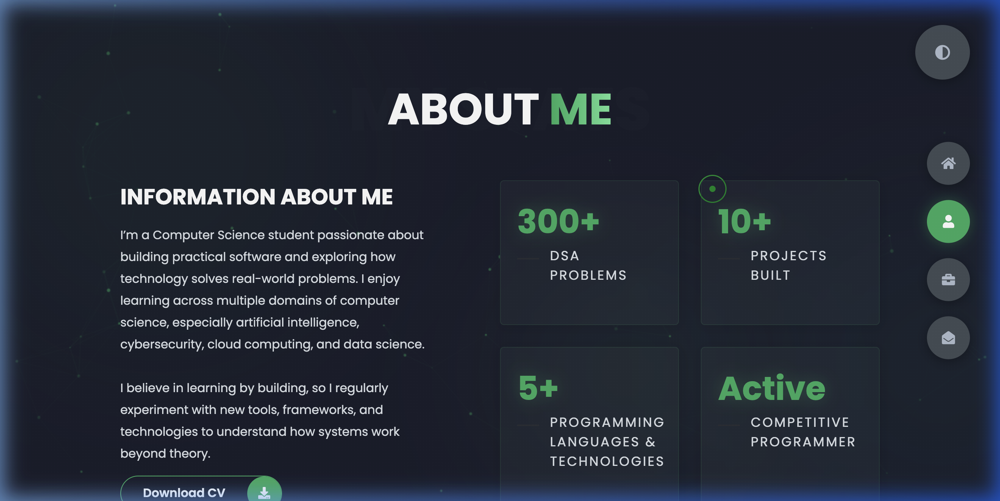
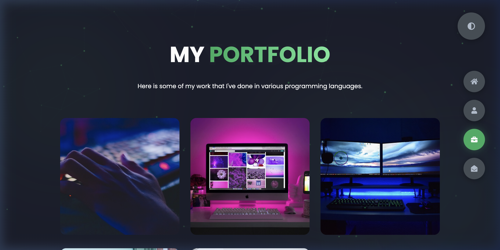
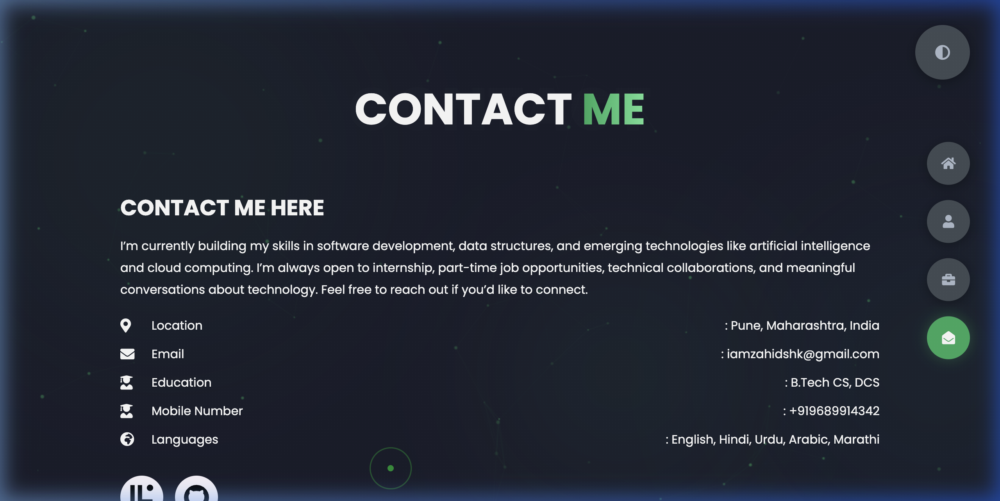
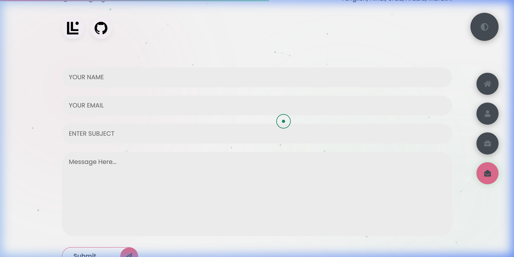

<div align="center">

# ⚡ Zahid Shaikh — Developer Portfolio

**A blazing-fast, cinematic personal portfolio with 31+ hand-crafted animations.**

[](https://iamzahid.netlify.app/)
[](./LICENSE)
[](https://github.com/iamshkzahid/My-Portfolio/stargazers)

<br/>

> *"The most insane portfolio you've seen — animations so smooth they feel illegal."*

---

**HTML** · **CSS** · **JavaScript** · **GSAP** · **Leaflet.js** · **EmailJS**

</div>

<br/>

## 🖥️ Preview

<div align="center">

### 🎬 Live Demo Recording


> *Full cinematic walkthrough — preloader → transitions → hover effects → theme toggle*

</div>

<br/>

## 📸 Screenshots

<table>
  <tr>
    <td align="center" width="50%">
      
      <br/><strong>🏠 Home — Hero Section</strong>
      <br/><sub>Profile photo, gradient text, particle background, social links</sub>
    </td>
    <td align="center" width="50%">
      
      <br/><strong>👤 About — Stats & Bio</strong>
      <br/><sub>Animated counters, glassmorphism cards, cinematic entry</sub>
    </td>
  </tr>
  <tr>
    <td align="center" width="50%">
      
      <br/><strong>💼 Portfolio — Projects Grid</strong>
      <br/><sub>3D tilt cards, shimmer sweep, hover overlay with links</sub>
    </td>
    <td align="center" width="50%">
      
      <br/><strong>✉️ Contact — Get in Touch</strong>
      <br/><sub>EmailJS form, Leaflet dark map, social icons</sub>
    </td>
  </tr>
  <tr>
    <td align="center" colspan="2">
      
      <br/><strong>☀️ Light Mode</strong>
      <br/><sub>One-click theme toggle with smooth CSS variable transition</sub>
    </td>
  </tr>
</table>

<br/>

## 🎬 What Makes This Different

This isn't just a portfolio. It's a **cinematic web experience** with studio-grade transitions, interactive particle physics, and touch-optimized mobile animations — all built with vanilla HTML, CSS, and JavaScript. Zero frameworks. Zero build tools.

<details>
<summary><strong>🔥 Click to expand: Full feature list (31 features)</strong></summary>

### 🎬 Transitions & Loading
| # | Feature | Description |
|---|---------|-------------|
| 1 | **Pacman Preloader** | Animated Pacman eating dots with a real-time 0→100% counter |
| 2 | **Cinematic Header Entry** | GSAP timeline: clip-path reveal → image slide → text fade sequence |
| 3 | **Bar-Wipe Section Transitions** | 5 green bars sweep across screen during navigation (like film editing) |
| 4 | **Section Content Animations** | Each section's content enters with staggered scale, fade, and slide effects |

### 🌌 Background & Atmosphere
| # | Feature | Description |
|---|---------|-------------|
| 5 | **Interactive Particle Network** | Canvas-based particles with mouse-repulsion physics and interconnecting lines |
| 6 | **Aurora Blobs** | 3 morphing, blurred gradient blobs drifting in the background |
| 7 | **Film Grain Overlay** | Subtle noise texture for a premium, cinematic feel |

### ✨ Visual Effects
| # | Feature | Description |
|---|---------|-------------|
| 8 | **Animated Gradient Text** | Flowing green gradient on section titles and name heading |
| 9 | **Shimmer Sweep** | Light sweep animation on portfolio card hover |
| 10 | **Glitch Letters** | Individual letter animations (rubberBand, jello, swing) on hover |
| 11 | **Text Scramble** | "Hacker terminal" character scramble on stat counters |
| 12 | **Animated Counters** | Numbers count up from 0 with eased GSAP tweens |
| 13 | **Skill Bar Fill** | Progress bars animate from 0% to target width |

### 🖱️ Desktop Interactivity
| # | Feature | Description |
|---|---------|-------------|
| 14 | **Custom Cursor** | Green dot + trailing ring that morphs on interactive elements |
| 15 | **Cursor Sparkle Trail** | Glowing particles follow your mouse in real-time |
| 16 | **Mouse Parallax** | Header elements shift with mouse movement for 3D depth |
| 17 | **Magnetic Buttons** | Nav buttons pull toward the cursor with elastic spring |
| 18 | **3D Card Tilt** | Glassmorphism perspective tilt on stat cards and portfolio items |

### 📱 Mobile-Only Features
| # | Feature | Description |
|---|---------|-------------|
| 19 | **Touch Sparkle Burst** | Tap anywhere → 8 sparkles radiate outward in a circle |
| 20 | **Swipe Navigation** | Swipe left/right to navigate sections with full bar-wipe transitions |
| 21 | **Touch Portfolio** | Tap to reveal project overlay (no hover needed) |
| 22 | **Gyroscope Parallax** | Tilt your phone → header elements shift for physical depth |
| 23 | **Swipe Hint** | Pulsing "Swipe to navigate ›››" arrow on first visit |

### 🔧 Utilities & UX
| # | Feature | Description |
|---|---------|-------------|
| 24 | **Dark/Light Theme** | One-click theme with CSS variable swap + transition flash |
| 25 | **URL Hash Persistence** | Section state preserved across page reloads and back-button |
| 26 | **Scroll Progress Bar** | Thin green bar at top shows scroll position |
| 27 | **Toast Notifications** | Slide-in success/error messages for form submission |
| 28 | **Leaflet.js Dark Map** | Interactive map in contact section with a custom marker |
| 29 | **EmailJS Contact Form** | Send emails directly from the browser — no backend needed |
| 30 | **Typing Cursor** | Blinking `│` cursor after intro paragraph |
| 31 | **External Links (New Tab)** | All social/project links open in new tabs with `target="_blank"` |

</details>

<br/>

## 🛠️ Tech Stack

| Layer | Technology |
|-------|-----------|
| **Structure** | HTML5, Semantic Elements |
| **Styling** | CSS3 (Custom Properties, Grid, Flexbox, `@keyframes`, `clip-path`) |
| **Logic** | Vanilla JavaScript (ES5 compatible, no transpiler needed) |
| **Animations** | [GSAP 3](https://greensock.com/gsap/) + ScrollTrigger |
| **Maps** | [Leaflet.js](https://leafletjs.com/) with CartoDB Dark tiles |
| **Email** | [EmailJS](https://www.emailjs.com/) (client-side email sending) |
| **Icons** | [Font Awesome 5](https://fontawesome.com/) |
| **Typography** | [Google Fonts — Poppins](https://fonts.google.com/specimen/Poppins) |
| **Letter Animations** | [Animate.css](https://animate.style/) |
| **Deployment** | [Netlify](https://www.netlify.com/) |

<br/>

## 📁 Project Structure

```
My-Portfolio/
├── index.html              # Single-page app — all 4 sections in one file
├── app.js                  # Navigation, theme toggle, hash routing, email
├── enhancements.js         # All 31 animation features (~1085 lines)
├── styles/
│   ├── style.css           # Core layout, colors, grids, 10 responsive breakpoints
│   └── enhancements.css    # Animation styles (particles, blobs, cursor, transitions)
├── img/                    # Portfolio screenshots, profile photo, README assets
├── files/                  # Resume/CV PDF
└── README.md               # You are here
```

<br/>

## 🚀 Quick Start

### Option 1: Just open it
```bash
# Clone the repository
git clone https://github.com/iamshkzahid/My-Portfolio.git

# Open in browser — no build tools, no npm, no setup
open My-Portfolio/index.html
```

### Option 2: Local dev server (for live reload)
```bash
# If you have VS Code, install "Live Server" extension and click "Go Live"
# OR use any static server:
npx serve My-Portfolio/
```

> **That's it.** No `npm install`. No `node_modules`. No webpack. Zero dependencies to manage.

<br/>

## 📐 Architecture

```
                    ┌──────────────────────┐
                    │     index.html       │
                    │  (4 stacked sections)│
                    └──────────┬───────────┘
                               │
              ┌────────────────┼────────────────┐
              │                │                │
      ┌───────▼──────┐ ┌──────▼──────┐ ┌───────▼──────┐
      │   app.js     │ │enhancements │ │  CDN Libs    │
      │              │ │    .js      │ │              │
      │ • Navigation │ │ • Particles │ │ • GSAP       │
      │ • Theme      │ │ • Preloader │ │ • Leaflet    │
      │ • Hash state │ │ • Transitions│ │ • EmailJS   │
      │ • Email form │ │ • 31 effects│ │ • Animate.css│
      └──────────────┘ └─────────────┘ └──────────────┘

    Navigation Flow:
    ────────────────
    Click nav button → app.js updates URL hash
                     → calls window.switchSection()
                     → enhancements.js runs bar-wipe GSAP timeline
                     → swaps .active class while screen is covered
                     → animates new section content in

    Mobile Flow:
    ────────────
    Swipe gesture → enhancements.js detects direction
                  → triggers same switchSection() pipeline
                  → touch sparkles burst on tap
                  → gyro parallax on tilt
```

<br/>

## 🎨 Customization Guide

<details>
<summary><strong>Want to use this as a template? Here's how to customize everything:</strong></summary>

### Change Colors
Edit CSS variables in `styles/style.css`:
```css
:root {
  --color-primary: #191d2b;    /* Background color */
  --color-secondary: #27AE60;  /* Accent color (green) */
}
```

### Change Map Location
Edit coordinates in `enhancements.js`:
```javascript
// Search for "setView" and change the lat/lng
.setView([18.5204, 73.8567], 13);  // [latitude, longitude], zoom
```

### Set Up Email
1. Create a free account at [emailjs.com](https://www.emailjs.com/)
2. Create a service (connect your Gmail) and an email template
3. Replace the IDs in `app.js`:
```javascript
emailjs.init("YOUR_PUBLIC_KEY");
emailjs.send("YOUR_SERVICE_ID", "YOUR_TEMPLATE_ID", params);
```

### Add a New Portfolio Project
Add a new `portfolio-item` block in `index.html`:
```html
<div class="portfolio-item">
    <div class="image">
        
    </div>
    <div class="hover-items">
        <h3>Project Name</h3>
        <div class="icons">
            <a href="https://github.com/you/repo" class="icon" target="_blank" rel="noopener noreferrer">
                <i class="fab fa-github"></i>
            </a>
            <a href="https://your-live-demo.com" class="icon" target="_blank" rel="noopener noreferrer">
                <i class="fas fa-external-link-alt"></i>
            </a>
        </div>
    </div>
</div>
```

</details>

<br/>

## 📱 Responsive Breakpoints

The site adapts across **10 breakpoints** for pixel-perfect layouts on every device:

| Breakpoint | Adaptation |
|-----------|-----------|
| `1600px` | Reduced section padding |
| `1432px` | Contact form wraps to column |
| `1250px` | Portfolio grid: 3 → 2 columns |
| `1070px` | About stats: 2 → 1 column |
| `970px` | Header: side-by-side → stacked |
| `768px` | Mobile mode: touch sparkles, swipe nav, gyro parallax |
| `700px` | Timeline: 2 → 1 column |
| `660px` | Portfolio: 2 → 1 column |
| `600px` | Small mobile: preloader scaled down |
| `400px` | Very small: further optimizations |

<br/>

## 🤝 Contributing

Contributions are welcome! Here's how to get started:

1. **Fork** this repository
2. **Clone** your fork: `git clone https://github.com/YOUR_USERNAME/My-Portfolio.git`
3. Create a feature branch: `git checkout -b feature/amazing-animation`
4. Make your changes (no build tools needed — just edit and refresh!)
5. **Commit**: `git commit -m "Add amazing animation"`
6. **Push**: `git push origin feature/amazing-animation`
7. Open a **Pull Request**

### 💡 Ideas for Contributions
- 🎭 New animation effects (scroll-triggered, intersection observer)
- 🌐 Multi-language / i18n support
- ♿ Accessibility improvements (ARIA labels, keyboard nav, `prefers-reduced-motion`)
- 🎨 New theme presets (neon, ocean, sunset)
- 📊 Blog section implementation
- 🧪 Performance optimization (IntersectionObserver for lazy animations)

<br/>

## 📄 License

This project is licensed under the **MIT License** — see the [LICENSE](./LICENSE) file for details.

You are free to use this as a template for your own portfolio. A ⭐ on the repo would be appreciated!

<br/>

---

<div align="center">

### 👤 About Me

**Zahid Shaikh** — Computer Science Student & Full-Stack Developer

Building practical software, solving 300+ DSA problems, and exploring AI, cybersecurity & cloud computing.

📍 Pune, Maharashtra, India &nbsp;·&nbsp; 🎓 B.Tech CS at PW Institute of Innovation

[](https://www.linkedin.com/in/zahid-shaikh-b33119349/)
[](https://github.com/iamshkzahid)
[](https://iamzahid.netlify.app/)

---

⭐ **If you liked this project, give it a star!** It helps others discover it.

<sub>Built with ❤️ and way too many GSAP timelines</sub>

</div>
